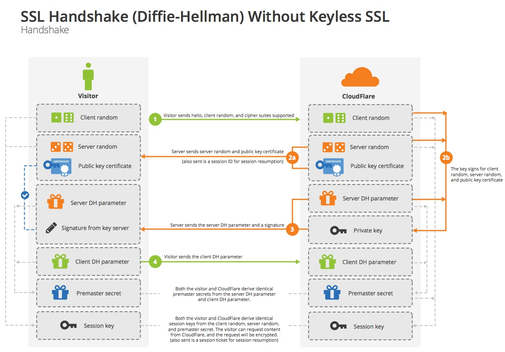

# I. Technologies / Configurations

## HTTP

### Protocol

A protocol is just a previously-agreed upon set of rules and standards by which we choose to
communicate. When you answer the phone, the first the yo do is say 'Hello'. This response lets the
caller know a few things. It lets them know a communication has been established and it lets them
know you speak English. From that moment on, you know to continue speaking English if you want to
continue the conversation.

HTTP is no different. There a lot of abstractions before we get to the level of HTTP, but for this
module, you can think of HTTP as simply sending text over a socket connection. If you're familiar
with concept of STDIN and STDOUT in computing, then you understand sockets at a conceptual level.
Instead of the STDOUT stream printing text to your terminal, it's sending that text over the
network. In this scenario, instead of sending the text to your terminal process, it's sending it
to a port/service on a remote computer. 

With HTTP, the receiving service, or web server, is listening; it's expecting to hear HTTP (like
English in the example above). Once it receives that block of text, it responds to the paramters
included in the HTTP request.

**An example of an HTTP request**
```
GET / HTTP/1.1
Host: www.company.com
Connection: keep-alive
User-Agent: Mozilla/5.0 (Windows NT 10.0; Win64; x64) AppleWebKit/537.36 (KHTML, like Gecko) Chrome/62.0.3202.94 Safari/537.36
Accept: text/html,application/xhtml+xml,application/xml;q=0.9,image/webp,image/apng,*/*;q=0.8
Accept-Language: en-US,en;q=0.9
```

**An example of an HTTP response**
```
HTTP/1.1 200 OK
Content-Type: text/html
Content-Length: 606
Set-Cookie: "you're totally an admin"

<p> this is an example http response</p>
```

Browsers are consumers of the HTTP protocol. They're preprogrammed to obey the standard. In the
response above, you'll notice a header called `set-cookie`. HTTP is a stateless protocol. That
means from on request to the next, it has no idea if you've been there before. To remedy this, we
use cookies. The `set-cookie` header instructs the browser to set a cookie. The protocol dictates
that when a browser is instructed to set a cookie, it does so and continues to send the cookie on
every subsequent call to that domain. The web server now knows who you are when you come back and
you can continue with the state your last request had. (Shopping carts, game progress). It sort of
works like a coat check ticket.

**Subsequent Requests**
```
GET / HTTP/1.1
Host: www.company.com
Connection: keep-alive
User-Agent: Mozilla/5.0 (Windows NT 10.0; Win64; x64) AppleWebKit/537.36 (KHTML, like Gecko) Chrome/62.0.3202.94 Safari/537.36
Accept: text/html,application/xhtml+xml,application/xml;q=0.9,image/webp,image/apng,*/*;q=0.8
Accept-Language: en-US,en;q=0.9
Cookie: "you're totally an admin"
```

Cookies are just one of many defined headers in the HTTP protocol. Every header has its own set of
directives which browsers know to obey.

### Browser Security Headers

Browser security headers are headers the server can set that improve the security of the user. These 
headers can do things like, require the user to use encryption, restrict which domains can iframe the origin
restrict access to which certificate authorities can be used to verify trust on the TSL certificate and more.

Additionally, two flags can be set on the Set-Cookie headers to improve credential security. These flags are 
the `Secure` and `HTTPOnly` flags, which requires encryption when transmitting cookies, and prevents javascript
from reading them, respectively.


Here is a list of the security headers we'll be covering

- Content Security Policy
- Cross Origin Resource Sharing
- HTTP Strict Transport Security

Note we will not be covering HPKP headers as they are planned to be depricated.

#### Content Security Policy
Content Security Policy is a security header that has a lot of configuration options that help security. Here's
what it looks like:

```
Content-Security-Policy: default-src 'self'; img-src *; media-src media1.com media2.com; script-src userscripts.example.com
```

Notice how the policy contains many directives. Here are three directives CSP supports that we'll cover in detail:

- frame-src
- script-src
- frame-ancestors

The frame-src directive controls which domains can be framed on the website. This helps mitigate frame injection attacks,
that can help lead to XSS, UI redressing, and redirect attacks.

The script-src directive is probably one of the more powerful directives. It controls which origins and methods for which
Javascript can be executed on the page. This is a powerful defense in depth counter measure against XSS attacks. Once an XSS
vulnerability has been identified, this directive can make it a lot more difficult to exploit. It can be used to disable eval
which is a common way to obfuscate XSS payloads. It can also set which origins can load javascript, restricting access to only
a set of allowed domains. This makes it harder for attackers to host larger scripts externally and execute them.

The frame-ancestors directive controls which domains can frame your origin. This helps mitigate clickjacking attacks, postMessage
attacks, and other attacks related to framing the origin in question.

#### Cross Origin Resource Sharing
These headers control which origins can make requests cross-origin and view the responses. By default no origin can make requests
and view the response to requests cross origin. The following headers relaxes the default security settings:

- Access-Control-Allow-Origin
- Access-Control-Allow-Methods
- Access-Control-Allow-Headers
- Control-Allow-Credentials


**Access-Control-Allow-Origin**
This is a list of domains that can make requests to your origin and view the response.

**Access-Control-Allow-Methods**
This lists the methods that are permitted to make requests cross origin and view the response

**Access-Control-Allow-Headers**
This controlls what custom headers can be set on cross origin requests

##### Control-Allow-Credentials
This header allows origins to make credentialed requests to the origin. This setting allows other origins to make authenticated
requests to the server.

#### HTTP Strict Transport Security
HTTP Strict Transport Security (HSTS) tells the browser to enforce ssl on a particular domain. That means, if you have visited company.com 
and the server has returned a HSTS header (for example: Strict-Transport-Security: max-age=15768000), your browser will enforce HTTPS 
for all future requests to that domain and will not allow HTTP requests. That mitigates certain MITM attacks, but only if you have visited 
that domain before. Browsers also have a preloaded list of certain domains that should enforce HSTS/HTTPS which mitigates the risk 
for domains from the list even if you have never visited them before.

If there is no HSTS, an attacker in a MITM position could use a tool like sslstrip to read all traffic by downgrading the victims requests 
from HTTPS to HTTP.

#### Secure and HTTPOnly flags
Flags set on cookies can increase the security of these credentials for the average user. Each cookie can be set with it's own set of flags,
as seen below:

```
Set-Cookie: cookie_one; path=/; HttpOnly
Set-Cookie: cookie_one; path=/; HttpOnly; Secure
```

Below is an overview of what each flag does:

**Secure flag**
The Secure flag set on cookies requires all requests be sent via encryption. This makes man in the middle attacks unlikely to steal the session
token. Without this flag, it is easy for a local attacker, an ISP, or another man-in-the-middle actor can easily compromise a user's account.

**HttpOnly flag**
The HTTPOnly flag prevents javascript from reading the cookie. This is a defense in depth protection against post exploitation attacks. Once a bad 
actor gets XSS on a victim, they will have a limited amount of time to affect damage, and the first thing they'll try to do is maintain persistance
on the account. They may attempt to do this by stealing passwords, or generating API tokens for themselves. The HTTPOnly flag cuts off one really
easy way to get persistance on the account: stealing the session cookie.


### Cookies
Since cookies are associated to session state and identity on most web applications, they're of
high value to attackers looking to compromise a site or company. Browsers have taken a proactive
stance on allowing developers to protect this information.

#### Common Attacks and Defenses Against Them

**Cross-Site Scripting**
We'll go more in depth into this in a later module. For now, let's just call this JavaScript
execution on a user's browser. Everything that persons JavaScript console can do, an attacker can
do. This includes access to a user's cookie with the `document.cookie` property. If that user is an
admin for the affected application, that opens the door for things like data breaches. As an
attacker, I know that it's natural for developers to become complacent with admin panel security
because they consider this area to be restricted and that only employees have access.
Bottom-line: indiscriminate access to user's JavaScript context, attacks can be devastating.

**How to Protect**
* Content Security Policy
CSP is an _additional_ security measure to prevent unauthorized code from executing on the client
side. CSP is a response header that informs browsers what content can and can't be loaded. It
takes a whitelist approach to external scripts and libraries. Specifically, you can block inline
script tags from executing. You can also make exceptions for inline script blocks with things like
whitelisting hashes of script blocks, or starting with CSP Level 2, using nonces.

`curl -s https://github.com -I | grep Policy | tr ';' "\n"`

See a site's CSP rule at [report-uri.com/home/analyse](https://report-uri.com/home/analyse)

Default Sources - Default allowed sources for child-src, connect-src, font-src, img-src, media-src,
  object-src, script-src and style-src.

- Base URI - the URI that a UA may use as the document base URL.
- Block All Mixed Content - Prevents the UA from loading any assets or issuing any requests using HTTP
- Child Sources - Allowed sources for elements such as frames and iframes.
- Connect Sources - Allowed sources for external connections such as XMLHttpRequest.
- Font Sources - Allowed sources for font loading.
- Form Actions - Allowed endpoints for form actions.
- Frame Ancestors - Allowed parents that may embed the page. (Does not apply to report-only header)
- Image Sources - Allowed sources for image loading.
- Media Sources - Allowed sources for loading media such as audio and video elements.
- Script Sources - Allowed sources for loading scripts.
- Style Sources - Allowed sources for loading stylesheets.


* Content-Type
In some cases, with modern JS libraries, there is a need to generate content on the frontend mixed
with content fetched from the backend. If ever this content is unescaped HTML, you can prevent
execution by instructing the browser that the returned data is of mime type `application/json` and
not `text/html`

```
# RESPONSE
HTTP/1.1 200
   Server: api.example.com
   Content-Type: text/html; charset=utf-8        <-- bad
   Content-Type: application/json; charset=utf-8 <-- good
   Content-Length: 373

{
  "callback": "store.com/?AddressLine2=FAKE<script>alert(1)</script>"
}
```

* iFrames
Sometimes you need to run code that you didn't write. In cases like these, it's possible to sandbox
the framework in an iframe. Iframes run in a different context/domain as the page in the URL bar.
* Output Encoding

* Cookie Protections
Secure - The browser will not allow the cookie to be read JavaScript
HttpOnly - The browser will not send cookies with the secure flag over an unencrypted HTTP request

```
Set-Cookie: <name>=<value>
[; <Max-Age>=<age>]
[; expires=<date>]
[; domain=<domain_name>]
[; path=<some_path>]
[; secure]
[; HttpOnly]
```

**Cross-Site Request Forgery**
CSRF attempts to force a state change by forcing a user to submit a form on a different domain.
Let's say all that's required to make a user an admin is a single POST request to `/user/5`. As an
attacker, I've made a regular user whose id ended up being `5`. I don't have access to the admin
panel. But I can make my own site with a button that POSTs a form to the my user's endpoint with
prepopulated fields. Once that site is live, I can tweet, email, or otherwise trick the admin to
clicking on my button. The browser will see it's trying to connect to `site.com` and if it has a
valid cookie for it, it will send it along with the request, authenticating as the admin user that
clicked my button.

**How to Protect**
Nonces, or **N**umbers you use **O**nce, can be sent along with a form on the admin page. This
ensures that only someone with actual access to the admin portal can send a state-changing request.
The server assigns a nonce to the form and expects the form submission to also include that nonce.
If it is missing, then the state-change is rejected.

**Related Side-Note**
All of these protections go out the window if traffic can be intercepted. Responses can be modified
to strip headers that are meant to protect the users (and malicious code added).
Always use SSL/TLS. Implement HSTS

## Crypto

### SSL/TLS

Let's start with Public/Private keys. Asymmetric encryption serves two purposes.
1. Encryption
1. Identity

When a pair is generated, only the private key can decrypt messages encrypted with the
corresponding public key.
Inversely, messages/software/files signed with a private key, can be verified with the
corresponding public key.

We can therefore assume that the owner of the private key is who they say they are. 

Diffie-Hellman
After WWII, when tensions were rising between the US and Russia, there arose a need for early
detection of nuclear missile launches. The US was most vulnerable over the North Pole. In response
to the rising threat, in 1958, Canada and the US form the North American Aerospace Defense Command.
NORAD had series of detection satellites communicating over telephone wires or radio frequencies
that terminated a mile underground in a bunker in Cheyenne, CO. There needed to be a way to relay
this information over what was an assumed-hostile network of long, unguarded network medium.
The Diffie-Hellman encryption scheme was created and used to protect these communications.

This same method is used currently in some TLS handshakes in order to establish a pre-shared key. DH
allows the key to be derived mathematically rather than shared over a network connection.


Let's take a look into how this all works in an SSL handshake.

A browser initiates a connection to an https page:
  - A CLIENT HELLO message is sent along with a list of available cipher suites

The server receives the request:
  - A comparison of Suites happens and the server picks one. (Let's use DH)
  - The server sends its signed public key

A client receives the server response:
  - It checks the signature against its local cert store

The server sends again:
  - It picks the DH parameters and keeps a secret
  - It signs them again with its private key

A client receives the server response:
  - It checks the signature against its local cert store
  - Client returns its DH parameters

Both parties, having the other's DH parameters,  can now derive a pre-master secret key without
having to transmit it. This key is used to continue all futures communications.



### Secure Storage

Depending on the application, it may need to communicate with other services through API calls or
other authenticated protocols. Sometimes the authentication/authorization requires keys or tokens
in the code so that the application logic knows how to communicate with these services. We usually
call these configuration options Secrets.

In situations where we have some control over the infrastructure on which our code is deployed,
following the "[12 factor app](https://12factor.net/)" framework (step iii) has the convenient
side-effect of allowing us to extract secret management and secure it appropriately.

By configuring our application to read secrets as environment variables, we remove the possibility
of leaking keys to critical infrastructure in source code. We can also revoke and recycle keys
without needing to redeploy application or change source code.

Consider Hashicorp Vault for secret management. At it's core, it's an encrypted key-value store
that serves secrets to authenticated clients. It comes with some pretty powerful key management
features as well. In the hypothetical event of compromised keys, Vault can recycle the keys and if
client application are configured correctly, they shouldn't be affected.

```python
import hvac

# The vault address can be fetched from the Guardians SharePoint page; it's environment-specific
vault_addr  = 'https://.....'

# The token can be fetched from the Goldfish interface
vault_token = 'F2DE45-1BC3.........'

# This is bucket name where your secrets reside
vault_name  = 'secret/captainamerica/steakover'

# Instantiate a Vaule client
vault = hvac.Client(url, token)

app_secrets = vault.read(vault_name)['data']
```

If no arguments are passed to the HVAC client, these environment variables are read as deafults.
The code above can be shortened to:

```
vault = hvac.Client()
app_secrets = vault.read('secret/captainamerica/steakover')['data']
```
